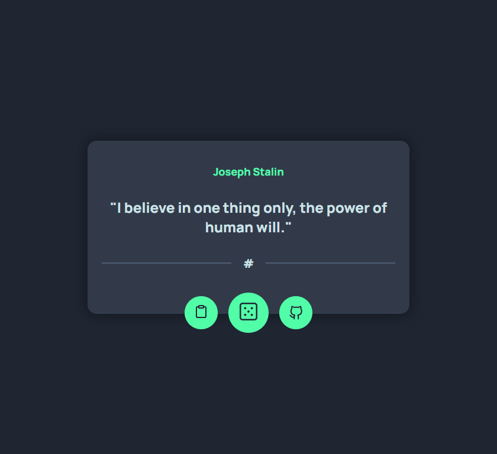

    <h2>⚜️ Q U O T E &nbsp; G E N E R A T O R ⚜️</h2>

    <a href="#-project">Project</a>&nbsp;&nbsp;&nbsp;|&nbsp;&nbsp;&nbsp;
    <a href="#-technologies">Technologies</a>&nbsp;&nbsp;&nbsp;|&nbsp;&nbsp;&nbsp;
    <a href="#-features">Features</a>

 

<h3 align="center">
    
     
    <a href="https://erickks.github.io/quote-generator/">live demo</a>
</h3>

 

## 📚 Project

I developed this project to practice my data manipulation from an API.

While being a simple project, I liked this idea and wanted to recreate it

 

## 🖥 Technologies

- [Html](https://www.w3schools.com/html/)
- [Css](https://www.w3schools.com/css/)
- [Javascript](https://www.javascripttutorial.net/)
- [Inspirational Quotes API](https://forum.freecodecamp.org/t/free-api-inspirational-quotes-json-with-code-examples/311373)

 

## 🧾 Features

- [x] Get a random quote from API
- [x] Copy quote for your clipboard
